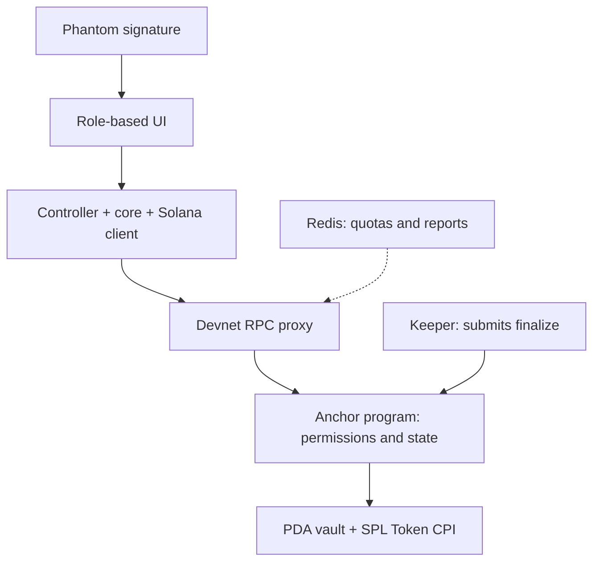

<p align="center"></p>
<h1 align="center">pipicachu · C2C escrow</h1>
<p align="center">USDC escrow for community digital-goods trades.<br>One deal link. Fixed terms. Funds held in a program vault.</p>
<p align="center">
<a href="https://github.com/2274802010922/pipicachu/actions/workflows/quality.yml"></a>
<a href="LICENSE"></a>

</p>
<p align="center"><a href="https://pipicachu.vercel.app">Open app</a> · <a href="#demo">Watch the demo</a> · <a href="#strengths-by-criterion">Strengths</a> · <a href="README.md">Tiếng Việt</a></p>

## The buyer wants to inspect. The seller wants to be paid.

A seller shares a template pack in a community. A buyer is interested; both already have Solana wallets and choose USDC. The seller wants to know the funds are ready before delivering files. The buyer wants an inspection period before releasing payment.

A community admin can help coordinate the deal. **pipicachu puts funds in a program vault and lets the parties' chosen arbitrator handle disputes.** Buyer, seller and arbitrator follow the same deal with agreed amounts, terms and deadlines.

## One link, four steps


| Step                     | Actor                                                                     | Result                                                   |
| ------------------------ | ------------------------------------------------------------------------- | -------------------------------------------------------- |
| **1. Create a link**     | Seller selects an available arbitrator and enters buyer, amount and terms | Fixed deal details and a shared link                     |
| **2. Fund**              | Buyer reviews terms and signs the USDC deposit                            | Funds enter the vault before delivery                    |
| **3. Deliver**           | Seller shares files through the agreed channel, enters a note and signs   | Deal enters buyer review                                 |
| **4. Confirm / dispute** | Buyer confirms receipt or disputes before the deadline                    | Program settles, or the arbitrator chooses payout/refund |

Arbitrators use a separate workspace to apply, receive approval, deposit bond and enable intake. **Prepaid capacity and standing consent** let new deals proceed directly to buyer funding. Capacity is reserved for active deals and released on settlement.

## Fees tied to the settlement outcome

A new **1 USDC** deal paid to the seller splits as follows:

| Recipient          |   Share |        Amount |
| ------------------ | ------: | ------------: |
| Seller             | **98%** | **0.98 USDC** |
| Arbitrator         |  **1%** | **0.01 USDC** |
| pipicachu platform |  **1%** | **0.01 USDC** |

All three amounts transfer in one transaction. Buyer refunds return the full escrow amount with zero service fees; SOL network fees are separate.

**Revenue model:** the platform collects 1% on seller payout; the arbitrator receives 1% for coordinating the deal. **Acquisition approach:** collaborate with admins of USDC communities and introduce deal links into their existing trading channels. A shared interface lets all three parties coordinate within those communities.

## Demo

[Open the app](https://pipicachu.vercel.app) · [Inspect a completed sample deal](https://pipicachu.vercel.app/deals/25JTcp8NdyqQoTksumh8hkUszc8SD3Ea3t2SNmor8Buj) · [Check its Explorer receipt](https://explorer.solana.com/tx/5a59q7bJQfGR5Qaxd3cPpV3QBTKRETvnMMKe8L64mTjirUzbQejrUBfs1DN2ArkTob7iSF45dU7raukS9AmWSTgK?cluster=devnet)


Finalized, CLI-signed **USDC Devnet sample:** 1 USDC →0.98 seller +0.01 arbitrator +0.01 platform. [Capture source and revision](docs/assets/showcase/current/manifest.json).

[](https://www.youtube.com/watch?v=mTY3e3qX_4k)

**v0.5 video · happy path · real Phantom:** 2 USDC →1.96 seller +0.02 arbitrator +0.02 platform. Vietnamese narration.

## Strengths by criterion

### BEST PRODUCT & BUSINESS

- **Specific users:** community buyers/sellers of files, templates and digital resources already using Solana wallets and USDC. Buyers get an inspection step, sellers see funded status before delivery, and arbitrators manage bond/deals in their workspace.
- **Fits existing trading channels:** one link for three roles, delivery through the agreed channel, four in-app steps and payout amounts shown before signing.
- **Fees enforced by the program:** 1% platform +1% arbitrator on seller payout, with full-principal, zero-service-fee refunds. Admin-led community acquisition connects the model to the people coordinating trades.

**Evidence:** [workflow and fees](docs/product/README.md) · [Devnet settlements](docs/evidence/v06/live/acceptance.json).

### BEST TECHNICAL BUILD

- **Financial edge cases handled:** a state machine for funding, delivery, review, disputes and settlement; capacity concurrency, payout/refund, single settlement and bond unlock invariants.
- **Compatibility across versions:** legacy/new deals, late-ruling policy and treasury aliases. Transfers consolidate by actual token account while conserving the escrow amount.
- **Evidence-based transaction recovery:** signature/blockhash/expiry tracking, finality monitoring, state checks before retry and rebroadcast of the same bytes. The harness covers native Rust, executable SBF, negative cases and principal/bond invariants.

**Evidence:** [Rust settlement](programs/pipicachu-escrow/src/settlement.rs) · [race/capacity/policy tests](tests/program/v06.ts) · [operation recovery](src/escrow/operation.ts).

### Most Innovative Solution

- **Two distinct intermediary responsibilities:** the program holds/transfers funds; the arbitrator rules between fixed recipients. Human dispute resolution remains part of the community workflow.
- **Standing consent + prepaid capacity:** arbitrators pre-fund a pool and enable intake. Buyer funding atomically checks capacity and reserves bond, removing per-deal acceptance signing and reusing released capacity.
- **One link coordinates roles:** shared terms, state and deadlines; each wallet sees its next appropriate action.

**Evidence:** [standing consent/capacity](docs/product/organization-flow.md) · [permissions and state machine](programs/pipicachu-escrow/src/lib.rs) · [view model](src/escrow/view-model.ts).

### Best Solana Integration

- **Solana holds and transfers USDC:** a per-deal PDA vault, SPL Token CPI and atomic seller/arbitrator/platform payout; refunds return to the buyer.
- **Clock and finality in the workflow:** deadlines use network Clock, wallets authorize transactions, and the UI follows confirmed/finalized status to report on-chain outcomes.
- **Independently inspectable receipts:** confirm, timeout, both ruling outcomes, late ruling, mutual settlement and service-signed keeper payout have Devnet evidence.

**Evidence:** [PDA/account constraints](programs/pipicachu-escrow/src/contexts.rs) · [six finalized branches](docs/evidence/v06/live/acceptance.json) · [keeper payout](docs/evidence/v06/live/keeper-payout.json).

### Best Security & Privacy Solution

- **Money permissions enforced by the program:** signer, role, mint, owner, PDA, state and fixed-recipient checks; checked arithmetic and payout totals conserve principal.
- **Validation around wallet signing:** simulation, message/signature binding, fixed Devnet genesis, bounded RPC inputs/responses and shared rate limiting. Money requests pass service checks before submission.
- **Data scoped to the task:** users retain keys and sign with Phantom; goods/evidence use the agreed channel and notes are hashed in the browser. Rate limiting stores expiring HMAC IP identifiers; the web server holds no participant private keys.

**Evidence:** [constraints](programs/pipicachu-escrow/src/contexts.rs) · [wallet binding](src/escrow/wallet-transaction.ts) · [RPC validation](src/backend/rpc.ts) · [HMAC/Redis](src/backend/redis.ts).

### Best User Experience

- **Four steps with role-based actions:** buyers fund/confirm, sellers deliver, arbitrators rule. The current stage and primary action are highlighted.
- **Short actions and clear feedback:** enter a note and sign; dialogs show amounts/recipients/fees. Signing, submitted, confirming, finalized and recovery states have distinct feedback.
- **VI/EN and responsive accessibility:** language switching preserves input; controls target 44px minimum, visible focus and keyboard support, with axe checks at 375/768/1024/1440px.

**Evidence:** [role flow](src/escrow/view-model.ts) · [responsive/axe QA](tests/e2e/organization.spec.ts) · [note/signing workflow](tests/e2e/simple-notes.spec.ts).


### Best System Architecture

- **Clear responsibility boundaries:** UI presents, controllers orchestrate actions, core handles state/amounts, the Solana client builds/reads instructions, the backend validates RPC, and the program decides money permissions.
- **Shared schemas and decisions:** IDL supplies discriminators/account order/signer/writable metadata; one view model determines role/action/deadline. BigInt/u64 amounts and ABI compatibility connect the layers.
- **Reproducible verification:** pinned dependencies/lockfile, Action SHAs and Agave checksum; CI compares Rust-generated IDL and runs web/browser/program tests. A complete account snapshot is batched into two RPCs.



**Evidence:** [module boundaries](docs/architecture/quality.md) · [IDL](client/idl/escrow.json) · [CI](.github/workflows/quality.yml) · [snapshot queries](src/escrow/queries.ts).

## Implementation evidence

| Result                          | Verified scope                                                                                   | Source                                                                               |
| ------------------------------- | ------------------------------------------------------------------------------------------------ | ------------------------------------------------------------------------------------ |
| **122 unit/integration tests**  | Amounts, state, codecs, permissions, operations and recovery                                     | [CI on dd32f2e](https://github.com/2274802010922/pipicachu/actions/runs/37876012065) |
| **41 browser tests**            | VI/EN, roles, responsive layout, keyboard/axe and injected wallet-provider interactions          | [Browser harness](tests/e2e/)                                                        |
| **6 finalized Devnet branches** | Confirm, delivery timeout, arbitrator payout/refund, late ruling and mutual refund; CLI fixtures | [Receipts and token deltas](docs/evidence/v06/live/acceptance.json)                  |
| **Keeper payout**               | One service-signed transaction with the 98/1/1 split and bond release                            | [Workflow-dispatch receipt](docs/evidence/v06/live/keeper-payout.json)               |
| **46 compatible deals**         | Money, fees, terms, state, workflow, policy and deadlines preserved across the verified upgrade  | [Binary/IDL/snapshot](docs/evidence/quality/protocol-rollout.json)                   |

Counts are tied to revisions and test types. The [technical report](docs/evidence/quality/README.md) records their sources.

## Run and reproduce

Node 24; pinned npm/dependencies and lockfile.

```bash
npm ci
cp .env.example .env.local
npm run dev
npm run verify
```

Linux/WSL program harness: `bash scripts/checks/program.sh`. [Deployment/config](docs/deployment/README.md) · [Architecture and permissions](docs/architecture/v06.md) · [Reproduction guide](docs/testing/reproduce.md) · [Contributor workflow](.github/CONTRIBUTING.md).

## Source and attribution

We built the state machine, constraints, settlement/bond logic, client, recovery, proxy/limiter and UI. Infrastructure uses Anchor, Solana SDK/SPL Token, Next.js and Phantom.

Code: [Apache-2.0](LICENSE) · [Third-party/artwork notices](THIRD_PARTY_NOTICES.md) · [Security reporting](.github/SECURITY.md).
