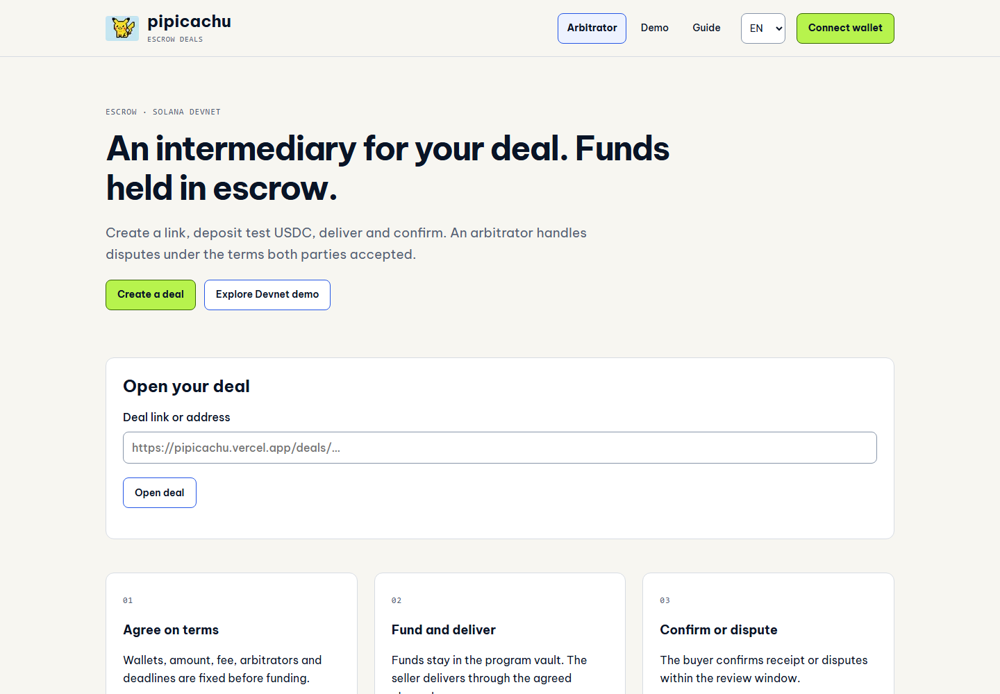
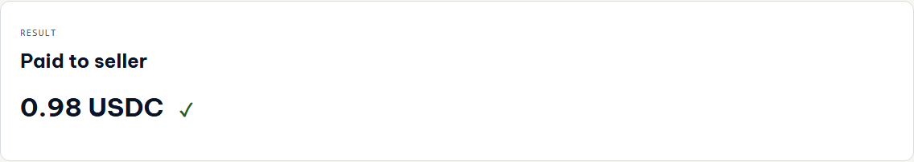
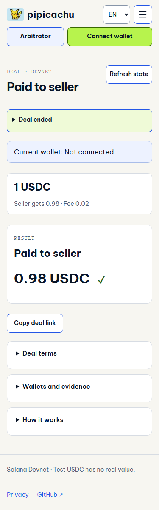
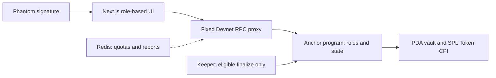

<p align="center"></p>
<h1 align="center">pipicachu · C2C escrow</h1>
<p align="center">USDC escrow for community digital-goods trades.<br>One deal link. Program-controlled funds. An arbitrator for disputes.</p>
<p align="center">
<a href="https://github.com/2274802010922/pipicachu/actions/workflows/quality.yml"></a>
<a href="LICENSE"></a>

</p>
<p align="center"><a href="https://pipicachu.vercel.app">Open app</a> · <a href="docs/judging/dossier.md">Judge dossier</a> · <a href="docs/judging/slides-v06.md">4-minute slides</a> · <a href="docs/evidence/quality/README.md">Evidence</a> · <a href="README.md">Tiếng Việt</a></p>

> **Working Solana Devnet prototype.** Test tokens; no independent audit or Mainnet deployment.

**Submission brief:** [English](docs/judging/submission.en.md) · [Tiếng Việt](docs/judging/submission.vi.md).

## Who delivers first? Who pays first?

File/template sellers want payment before delivery. Buyers dealing with unfamiliar sellers want to inspect first. A community admin can help, but holding money in a personal wallet creates another dependency for both parties.

pipicachu separates **holding funds** from **ruling on disputes**. Buyers deposit USDC into a program vault. The arbitrator can choose payout/refund to fixed recipients; the app does not verify file quality.

The target group is community digital-goods buyers/sellers **who already have Solana wallets and choose USDC**. [The FTC documents fake-payment risks in online selling](https://consumer.ftc.gov/consumer-alerts/2022/07/selling-stuff-online-heres-how-avoid-scam); that is scenario context, not pipicachu customer evidence. Demand and willingness to pay still need validation.

## See the working product



**Four steps:** seller creates a link → buyer funds → seller delivers → buyer confirms or disputes. Delivery, dispute and ruling use a short note and wallet signature. Goods/evidence use the agreed external channel.

Arbitrators prepare separately: apply → manager approves → deposit bond → enable intake. Standing consent removes per-deal acceptance signing; prepaid funds bound capacity. Approval is an allowlist, not KYC.

[Open a real Devnet result](https://pipicachu.vercel.app/deals/25JTcp8NdyqQoTksumh8hkUszc8SD3Ea3t2SNmor8Buj) · [Explorer receipt](https://explorer.solana.com/tx/5a59q7bJQfGR5Qaxd3cPpV3QBTKRETvnMMKe8L64mTjirUzbQejrUBfs1DN2ArkTob7iSF45dU7raukS9AmWSTgK?cluster=devnet)



Current deployment captures showing a finalized CLI Devnet fixture, not a customer transaction. [Capture source/revision](docs/assets/showcase/current/manifest.json).

<details>
<summary>Recorded Phantom demo and mobile UI</summary>

[](https://www.youtube.com/watch?v=mTY3e3qX_4k)

Owner-recorded **v0.5 happy path**: 2 USDC → 1.96 seller +0.02 arbitrator +0.02 platform. It does not show v0.6 governance, late ruling or keeper. The EN video awaits separate footage.



</details>

## Strengths you can inspect

| Value                                                       | Implementation and evidence                                                                                                                                                        |
| ----------------------------------------------------------- | ---------------------------------------------------------------------------------------------------------------------------------------------------------------------------------- |
| Intermediaries rule without personally holding principal    | PDA vault, fixed recipients and role permissions: [constraints](programs/pipicachu-escrow/src/contexts.rs)                                                                         |
| Principal, fees and reserved bond settle together           | Atomic 98/1/1 payout, full refund, unlock once and treasury aliases: [settlement](programs/pipicachu-escrow/src/settlement.rs), [receipts](docs/evidence/v06/live/acceptance.json) |
| No acceptance signature from the arbitrator per deal        | Standing consent and prepaid capacity: [workflow](docs/product/organization-flow.md), [race/capacity tests](tests/program/v06.ts)                                                  |
| Slow RPC or rejected signing never becomes false completion | Simulation, message/signature binding, finality and recovery: [operation](src/escrow/operation.ts), [tests](tests/unit/operation.test.ts)                                          |

The proposed difference is **community workflow + program-enforced money rules + role-based UX**, not a claim that escrow has no competitors. [Alternatives and judge questions](docs/judging/questions.md).

## Business: users and payment

- **Users:** USDC community buyers/sellers of files, templates and digital resources; community admins as arbitrators.
- **Implemented fees:** seller gets 98%, arbitrator 1%, platform 1% on payout. Refunds return all principal without service fees; SOL fees are separate.
- **Proposed acquisition:** pilots through 1–2 admins, with 5–10 buyers/sellers testing and deciding on a concrete fee. These are plans, not traction.
- **Validation needed:** completion, fee/deadline understanding, repeat-use intent and willingness to pay. Devnet tokens are not revenue.

[Validation kit](docs/product/validation-kit.md). No demonstrated moat or paid-customer evidence yet.

## Why Solana, and what we built

Solana holds/transfers USDC through PDA vaults, SPL Token CPI and atomic settlement. Network Clock governs deadlines, wallets authorize actions and receipts are independently inspectable. A database-only replacement returns custody authority to an operator.



We built the state machine, constraints, settlement/bond logic, IDL-based client, recovery, bounded proxy/limiter and UI. Anchor, Solana SDK/SPL Token, Next.js and Phantom supply infrastructure. [Attribution](THIRD_PARTY_NOTICES.md).

## Current evidence

| Area                                                  | Source                                                                                                                                                  |
| ----------------------------------------------------- | ------------------------------------------------------------------------------------------------------------------------------------------------------- |
| 122 unit/integration +41 browser; both CI jobs passed | [CI on 463b3fa](https://github.com/2274802010922/pipicachu/actions/runs/37812338693), [simplified workflow QA](docs/evidence/quality/simple-notes.json) |
| Six finalized Devnet branches, principal/bond checks  | [Acceptance](docs/evidence/v06/live/acceptance.json) — CLI fixtures, not six Phantom flows                                                              |
| Actual service-signed keeper payout                   | [Keeper proof](docs/evidence/v06/live/keeper-payout.json) — dispatch, not cron uptime proof                                                             |
| Binary/IDL/ABI; 46 existing deals unchanged           | [Rollout](docs/evidence/quality/protocol-rollout.json), [reproduction](docs/testing/reproduce.md)                                                       |
| Owner reported a successful Phantom flow              | Manual report on 08 October; detailed per-case receipts/checklists were not supplied                                                                    |

[Current report](docs/evidence/quality/README.md). Older [checkpoints](docs/evidence/v06/README.md) are history; test counts are not added across revisions.

## Run from a fresh checkout

Node 24; pinned npm/dependencies and lockfile.

```bash
npm ci
cp .env.example .env.local
npm run dev
npm run verify
```

Linux/WSL program tests: `bash scripts/checks/program.sh`. Local fixtures use a synthetic mint; Devnet fixtures have separate receipts. [Deployment/env](docs/deployment/README.md) · [Architecture](docs/architecture/v06.md) · [IDL](client/idl/escrow.json) · [Contributor workflow](.github/CONTRIBUTING.md).

## Trust boundaries

An arbitrator can rule incorrectly. Bond is capacity, not insurance/slashing; abandonment without mutual agreement may lock funds. Scheduled keeper execution may be delayed; the pitch uses buyer confirmation. Devnet upgrade authority remains. Hashes neither verify goods nor encrypt notes. Files/evidence are not uploaded to the app server.

No independent audit, Mainnet or revenue validation. [Security reporting](.github/SECURITY.md) · [Dependency exceptions](docs/legal/dependency-exceptions.md) · [Apache-2.0](LICENSE). Third-party logo/artwork rights are outside the code license.
