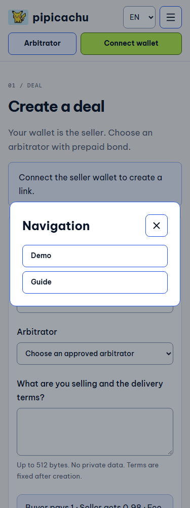
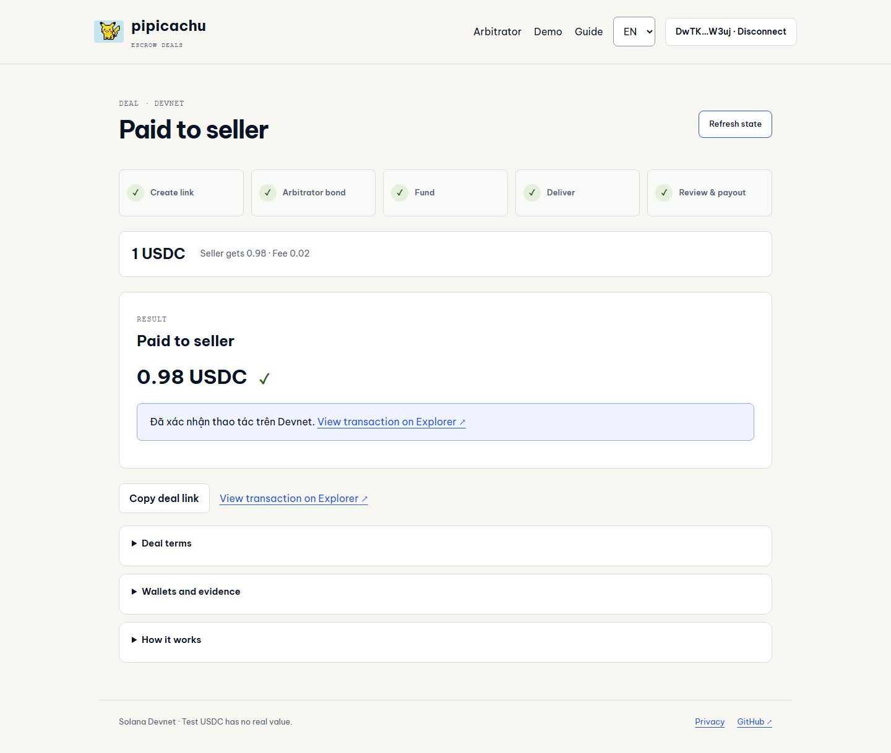
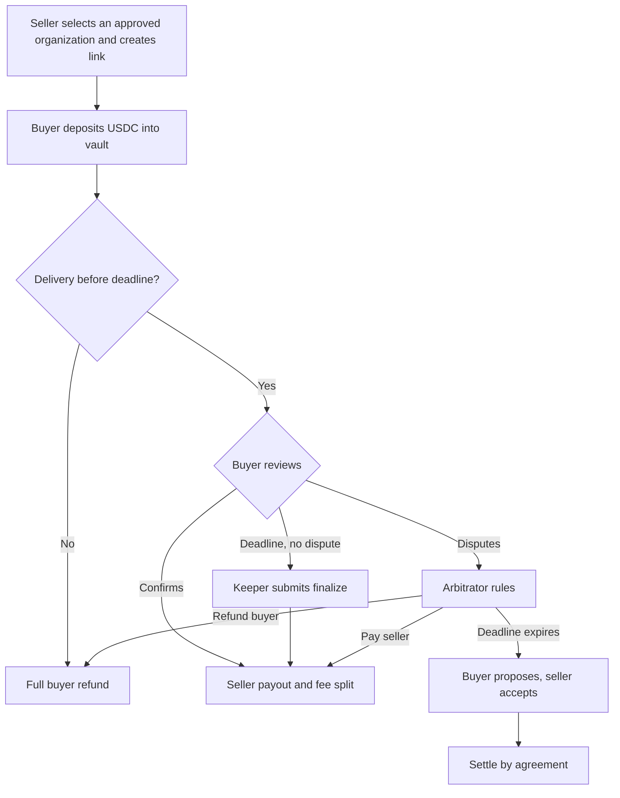

<p align="center"></p>
<h1 align="center">pipicachu · Escrow deals</h1>
<p align="center">A deal link for community intermediaries and their customers.<br>Buyers deposit USDC, sellers deliver, funds settle under agreed conditions.</p>

<p align="center">
  <a href="https://github.com/2274802010922/pipicachu/actions/workflows/quality.yml"></a>
  <a href="LICENSE"></a>
  <a href="https://pipicachu.vercel.app/demo"></a>
</p>
<p align="center"><a href="https://pipicachu.vercel.app"><strong>Open product</strong></a> · <a href="https://pipicachu.vercel.app/demo">Explore demo scenarios</a> · <a href="docs/evidence/README.md">Inspect evidence</a> · <a href="README.md">Tiếng Việt</a></p>


> **Devnet demo.** Test USDC has no real value. Upgrade authority is retained; there is no independent audit. Do not use real assets.

## Current status · 5 October 2026

**v0.5, Devnet only**, with the UI deployed at the [visual checkpoint](https://github.com/2274802010922/pipicachu/commit/4530c03). This is an evolving MVP, **not a complete implementation of every flow or edge case**.

| Area                              | Current status                                                                                                                                     |
| --------------------------------- | -------------------------------------------------------------------------------------------------------------------------------------------------- |
| Light terminal VI/EN UI           | Deployed: 44px header controls, two-row mobile header/menu, consistent buttons and spacing                                                         |
| Create / fund / deliver           | Existing flow preserved; prepaid organization registry implemented on-chain                                                                        |
| User-wallet arbitrator onboarding | **Not implemented** as a separate registration → approval → deposit → enable UI flow                                                               |
| Current arbitrator                | Owner-supplied `7PpWKXsjxR6f7Zu8Se11h2nWkEyaaNVxLLd6XF9K39CG`, approved; its owner must deposit and enable. Previous Demo A disabled for new deals |
| Seller equals platform treasury   | **Known error 2040, not fixed**; see outstanding work below                                                                                        |
| Actual Phantom extension          | Owner recording shows actual Phantom signing and a 2 USDC payout; not testing every case                                                           |

## UI showcase

Screenshots from the **deployed website**, captured on 5 October 2026, not mockups. These screens show the disconnected-wallet state.


<table>
<tr><th>Mobile · Vietnamese</th><th>Create form · English</th></tr>
<tr>
<td></td>
<td></td>
</tr>
</table>

<details>
<summary>View the mobile menu</summary>



</details>

The arbitrator workspace has its own header entry. Separate registration/approval/deposit onboarding is still pending. [Design system](docs/design/system.md) · [Capture scope](docs/assets/showcase/README.md).

## Who is it for?

Community intermediaries handling digital goods/services, and their buyers and sellers. Buyers deposit into a Solana program vault instead of the intermediary's personal wallet. All parties share the same deal state and receipts; an arbitrator handles disputes under fixed permissions.

This is a technical MVP. User research, revenue and willingness to pay have not been validated. It currently uses **Devnet USDC**, with no USDT or VND P2P flow.

## See it running

[](https://www.youtube.com/watch?v=mTY3e3qX_4k)

[**Watch on YouTube →**](https://www.youtube.com/watch?v=mTY3e3qX_4k) · 2:56 · Vietnamese male narration and subtitles. Seller left, buyer right; 2 USDC Devnet, seller receives 1.96 USDC. Intro personas are fictional; file delivery, dispute and keeper are not shown. [Script and review scope](docs/demo/video-vi-2026-10-05/README.md). English video awaits separate English-UI footage.

[**Open the demo lab →**](https://pipicachu.vercel.app/demo) Seven sample links: one prepaid-organization deal plus six historical fee/legacy scenarios with finalized receipts. Test-wallet transactions do not establish correctness for every wallet combination.



## What the current build does well

| Strength                                                 | Implementation                                                                   | Inspect                                            |
| -------------------------------------------------------- | -------------------------------------------------------------------------------- | -------------------------------------------------- |
| Principal stays outside the arbitrator's personal wallet | Program-controlled vault; arbitrator can only pay seller or refund buyer         | [Rust](programs/pipicachu-escrow/src/lib.rs)       |
| Clear terms before funding                               | Fixed participants, mint, amount, fees and deadlines                             | [Policy](docs/product/README.md)                   |
| Atomic settlement                                        | Payout, both fees and bond unlock together; reject redirects and repeated payout | [Program tests](tests/program/cycle.ts)            |
| Fee-free refunds                                         | Full principal to buyer; arbitrator bond is separate                             | [Receipts](docs/evidence/devnet-escrow-cycle.json) |
| Timeout payout without another seller signature          | Keeper submits finalize; disputes block automatic payout                         | [Live keeper](docs/evidence/keeper-live.json)      |
| A readable next step                                     | Consistent VI/EN UI, highlighted current step, one primary action                | [Design](docs/design/system.md)                    |

## Prepaid approved organizations

Initializer-approved arbitrators deposit a pool and sign standing consent once. Sellers select the registry; buyer funding reserves bond atomically without per-deal arbitrator signing. Four-step UI, no repetitive checkboxes or manual arbitrator address/time fields. Legacy deals retain manual acceptance. [Policy](docs/product/organization-flow.md), [13 live Devnet checks](docs/evidence/devnet-organization-checks.json). Previous Demo A remains historical evidence only. The current wallet is owner-selected; approval does not establish corporate identity.

## Deal flow



Without agreement after the arbitrator expires, funds may remain locked. A **10% arbitrator bond** locks when the buyer funds and unlocks at settlement. It is not insurance or a wrongful-ruling penalty.

## Transparent fees

For a **new 1 USDC deal**, the buyer deposits exactly 1 USDC:

| Outcome       | Buyer refund | Seller receives | Arbitrator | Platform  |
| ------------- | ------------ | --------------- | ---------- | --------- |
| Seller payout | —            | 0.98 USDC       | 0.01 USDC  | 0.01 USDC |
| Buyer refund  | 1 USDC       | 0               | 0          | 0         |

Legacy deals keep their original fee snapshot. Each 1% fee rounds down to atomic USDC units; the seller keeps any remainder. SOL network fees and the arbitrator bond are separate.

<details>
<summary>Public Devnet addresses</summary>

| Component               | Address                                        |
| ----------------------- | ---------------------------------------------- |
| Program                 | `4Xds5m5JtWR8HbNLdGeF7e3Qh3akKMHwMfjKsQeVXnrb` |
| Circle Devnet USDC mint | `4zMMC9srt5Ri5X14GAgXhaHii3GnPAEERYPJgZJDncDU` |
| Platform treasury       | `CXjKGEBNTTotzoF26nGPfAG4AFicGgP72SMqUQKY1pJN` |

The immutable FeeConfig defines the treasury; UI/env cannot select the recipient. [Health](https://pipicachu.vercel.app/api/health), [deployment source](src/escrow/deployment.json), [legacy rollout](docs/evidence/platform-fee-rollout.json).

</details>

## Evidence, with scope

| Verified scope           | Result / source                                                                         |
| ------------------------ | --------------------------------------------------------------------------------------- |
| Unit and IDL             | **55 tests**                                                                            |
| Browser                  | **26 tests** · VI/EN · 375/768/1024/1440px · axe                                        |
| Local smart contract     | **52 executable checks** · 39 legacy + 13 organization checks · labelled synthetic mint |
| Devnet                   | **39 checks**, **6 scenarios** with finalized vault-transfer receipts                   |
| Legacy fee compatibility | Pre-upgrade funded deal pays 99% seller, 0% platform                                    |
| Keeper service           | Real keeper signer; 98/1/1 payout; disputed deal untouched                              |
| Deployed website         | Signing and rejection using a test provider, not actual Phantom-extension verification  |

[Evidence index](docs/evidence/README.md) separates live receipts, synthetic fixtures and browser scope. The CI badge shows the latest run; web test counts are the 5 October 2026 visual-checkpoint snapshot; historical receipts retain their own dates and scope. Keeper runs approximately every five minutes and may be delayed; there is no exact payout-time guarantee.

## Architecture and original work

```text
Next.js UI + Phantom → Devnet RPC proxy → Rust / Anchor
                                        ├─ Deal + USDC vault
                                        ├─ Arbitrator + bond vault
                                        └─ Immutable mint / fee config
GitHub Actions keeper ─────────────────→ finalize after deadline
```

Original work: state machine, account constraints, vault/bond handling, transaction client, keeper, VI/EN UI and harness. Anchor/SPL provide serialization and token CPI. The backend holds no withdrawal signing key; the dedicated keeper wallet uses Devnet SOL for fees. This project does not claim to invent escrow.

| Review area            | Source                                                                                              |
| ---------------------- | --------------------------------------------------------------------------------------------------- |
| Smart contract / IDL   | [lib.rs](programs/pipicachu-escrow/src/lib.rs) · [escrow.json](client/idl/escrow.json)              |
| Client / state         | [client.ts](src/escrow/client.ts)                                                                   |
| Architecture / policy  | [Architecture](docs/architecture/README.md) · [Product](docs/product/README.md)                     |
| Tests / evidence       | [Testing](docs/testing/README.md) · [Evidence](docs/evidence/README.md)                             |
| Vercel / Devnet        | [Deployment](docs/deployment/README.md)                                                             |
| Continuing development | [CURRENT_STATE](docs/harness/context/CURRENT_STATE.md) · [HANDOFF](docs/harness/context/HANDOFF.md) |

## Run locally

Use **Node.js 24**, npm and a Devnet RPC, from this repository's own checkout:

```bash
npm ci
cp .env.example .env.local
npm run dev
```

PowerShell can use `Copy-Item .env.example .env.local`. The two variables in `.env.example` are sufficient for the web app; never put a private key on Vercel.

```bash
npm run verify       # format, lint, types, unit, build, browser, docs
npm run check:live   # verify Devnet program, mint and treasury
```

Program tests require Linux/WSL, Solana CLI 3.1.10 and Rust; see [testing](docs/testing/README.md). Forks need separate keys, program and keeper before deployment; see [deployment](docs/deployment/README.md).

## Outstanding fixes and work

- **Confirmation error 2040:** `ConstraintDuplicateMutableAccount` at `platform_token` was reproduced when the seller equals the platform treasury. Buyer SOL was sufficient. This alias can block seller payout/keeper; adding funds or swapping wallets is not the fix. No contract fix is deployed; the passing suite does not cover this case.
- **Funding-state wording:** a new-workflow screen still says “Waiting for the arbitrator” instead of “Waiting for the buyer to fund escrow”. This known UI issue was not changed by the visual refresh.
- **Arbitrator onboarding:** user-wallet registration → manager approval → separate bond deposit → enable deals is planned. Current registry setup uses maintainer tooling; Demo A is not presented as user registration or a real partner.
- **Phantom/video evidence:** owner-recorded actual Phantom happy path for 2 USDC is available; dispute/keeper and every wallet combination are not covered. Previous Picachu videos are not escrow evidence.

The create-deal flow stays unchanged in the next plan. Visual cleanup does not resolve these outstanding items.

## Limits

Escrow does not verify off-chain goods, identities or whether a game account can be reclaimed. Hashes bind evidence exchanged separately. There is no wrongful-ruling slashing, appeal, insurance or independent audit. Upgrade authority and the USDC issuer remain trust assumptions. Mainnet, AI, marketplace and off-ramp are outside this MVP.

## License and attribution

Original project code and documentation use **[Apache License 2.0](LICENSE)**. [NOTICE](NOTICE), [third-party notices](THIRD_PARTY_NOTICES.md) and [license scope](docs/legal/README.md) retain upstream attribution and separate dependency/font licenses. The pixel logo is excluded; no third-party artwork, character or trademark rights are granted. Earlier revisions retain their historical notices.

Author: **O Bao Tri · [@2274802010922](https://github.com/2274802010922)**. [Contributing](.github/CONTRIBUTING.md) · [Security reports](.github/SECURITY.md).

<details>
<summary>Project history</summary>

The former transaction explainer remains at checkpoint `7315d42`. Receipts before platform fees and the two-arbitrator version are in [archive](docs/archive/README.md). The previous Picachu project is untouched; its videos are not presented as escrow demos.

</details>
