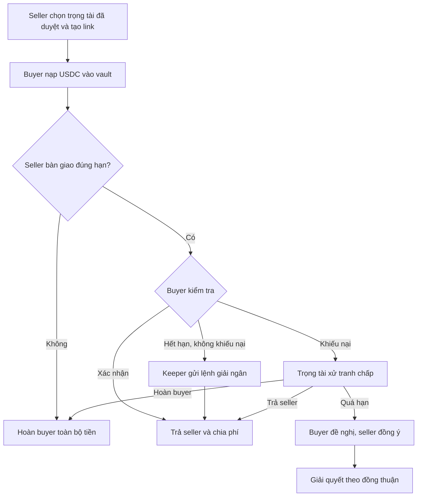

<p align="center"></p>
<h1 align="center">pipicachu · Giao dịch trung gian</h1>
<p align="center">Một link ký quỹ cho admin trung gian và khách của họ.<br>Người mua nạp USDC, người bán bàn giao, tiền được trả theo điều kiện đã chốt.</p>

<p align="center">
  <a href="https://github.com/2274802010922/pipicachu/actions/workflows/quality.yml"></a>
  <a href="LICENSE"></a>
  <a href="https://pipicachu.vercel.app/demo"></a>
</p>
<p align="center"><a href="https://pipicachu.vercel.app"><strong>Mở sản phẩm</strong></a> · <a href="https://pipicachu.vercel.app/demo">Thử các kịch bản</a> · <a href="docs/evidence/README.md">Xem bằng chứng</a> · <a href="README.en.md">English</a></p>


> **Demo Devnet.** USDC thử nghiệm không có giá trị thật. Chương trình còn quyền nâng cấp và chưa audit độc lập. Không dùng tài sản thật.

## Dành cho ai, giải quyết việc gì?

Admin trung gian giao dịch hàng/dịch vụ số qua cộng đồng, cùng người mua và người bán của họ. Thay vì gửi tiền vào ví cá nhân của admin, người mua nạp vào vault do chương trình Solana quản lý. Các bên xem cùng một trạng thái và receipt; trọng tài xử tranh chấp theo quyền đã chốt.

Đây là MVP kỹ thuật. Chưa có nghiên cứu người dùng, doanh thu hoặc mức sẵn sàng trả phí được kiểm chứng. Sản phẩm hiện dùng **USDC Devnet**, chưa triển khai USDT hay giao dịch P2P VND.

## Xem sản phẩm chạy thật

[**Mở phòng demo →**](https://pipicachu.vercel.app/demo) Chọn một trong 6 deal có receipt finalized: xác nhận nhận hàng, hết hạn kiểm tra, hoàn tiền khi không giao, trọng tài trả người bán, trọng tài hoàn người mua và đồng thuận sau hạn trọng tài.


## Điểm mạnh của bản hiện tại

| Điểm mạnh                                 | Cách triển khai                                                       | Nơi kiểm chứng                                    |
| ----------------------------------------- | --------------------------------------------------------------------- | ------------------------------------------------- |
| Tiền không nằm trong ví cá nhân trọng tài | Vault của chương trình; trọng tài chỉ chọn trả seller hoặc hoàn buyer | [Rust](programs/pipicachu-escrow/src/lib.rs)      |
| Điều kiện rõ trước khi nạp                | Các bên, mint, số tiền, phí và thời hạn cố định theo deal             | [Chính sách](docs/product/README.md)              |
| Chia tiền trong một transaction           | Payout + hai phí + mở cọc nguyên tử; chặn đổi recipient và chi lặp    | [Kiểm thử](tests/program/cycle.ts)                |
| Hoàn tiền không thu phí                   | Buyer nhận lại nguyên principal; cọc trọng tài tách riêng             | [Receipt](docs/evidence/devnet-escrow-cycle.json) |
| Hết hạn không cần seller ký thêm          | Keeper gửi finalize; tranh chấp chặn payout tự động                   | [Keeper thật](docs/evidence/keeper-live.json)     |
| Dễ theo dõi từng bước                     | UI VI/EN, bước hiện tại nổi bật, một hành động chính                  | [Design system](docs/design/system.md)            |

## Trọng tài cọc trước — flow mới

Trọng tài được initializer duyệt, nạp quỹ và ký bật nhận theo policy một lần. Seller chọn từ registry; buyer fund tự bảo lưu cọc. Không có lượt ký accept cho mỗi deal mới. UI4 bước, bỏ checkbox lặp và nhập ví trọng tài/thời hạn thủ công. Deal cũ giữ cách chấp thuận cũ. [Policy và tương thích](docs/product/organization-flow.md), [13 ca Devnet](docs/evidence/devnet-organization-checks.json). Demo A là tổ chức thử nghiệm, không phải đối tác công ty thật.

## Luồng giao dịch



Nếu trọng tài quá hạn và hai bên không đồng thuận, tiền có thể tiếp tục bị khóa. Cọc khóa **10% giá trị deal** khi buyer nạp, mở khóa khi deal kết thúc; cọc chưa phải bảo hiểm hay cơ chế phạt xử sai.

## Phí minh bạch

Ví dụ **deal mới 100 USDC**; buyer nạp đúng 100 USDC, không cộng phí vào principal:

| Kết quả        | Người mua nhận lại | Người bán nhận | Trọng tài | Hệ thống |
| -------------- | ------------------ | -------------- | --------- | -------- |
| Trả người bán  | —                  | 98 USDC        | 1 USDC    | 1 USDC   |
| Hoàn người mua | 100 USDC           | 0              | 0         | 0        |

Deal cũ giữ snapshot phí đã chốt, không thu thêm phí hệ thống hồi tố. Mỗi phí 1% làm tròn xuống đơn vị nguyên USDC, phần dư thuộc seller. Phí mạng SOL và cọc trọng tài tách khỏi bảng này.

<details>
<summary>Địa chỉ và cấu hình công khai trên Devnet</summary>

| Thành phần                | Địa chỉ                                        |
| ------------------------- | ---------------------------------------------- |
| Program                   | `4Xds5m5JtWR8HbNLdGeF7e3Qh3akKMHwMfjKsQeVXnrb` |
| USDC mint · Circle Devnet | `4zMMC9srt5Ri5X14GAgXhaHii3GnPAEERYPJgZJDncDU` |
| Ví hệ thống               | `CXjKGEBNTTotzoF26nGPfAG4AFicGgP72SMqUQKY1pJN` |

Treasury lưu trong FeeConfig immutable; không chọn recipient bằng UI hoặc env. [Health](https://pipicachu.vercel.app/api/health), [cấu hình source](src/escrow/deployment.json), [rollout/legacy](docs/evidence/platform-fee-rollout.json).

</details>

## Bằng chứng thay cho lời hứa

| Phạm vi đã kiểm      | Kết quả / nguồn                                                                |
| -------------------- | ------------------------------------------------------------------------------ |
| Unit và IDL          | **55 tests**                                                                   |
| Browser              | **21 tests** · VI/EN · 375/768/1024/1440px · axe                               |
| Smart contract local | **39 executable checks** · mint synthetic có nhãn                              |
| Devnet               | **39 checks**, **6 kịch bản** có receipt finalized đối chiếu số tiền           |
| Tương thích phí cũ   | Deal nạp trước upgrade vẫn trả seller 99%, platform 0%                         |
| Keeper               | Signer service thật; chia 98/1/1; dispute không bị chi                         |
| Website đã deploy    | Signed flow và từ chối ký bằng test provider; chưa kiểm extension Phantom thật |

Đọc [bộ bằng chứng](docs/evidence/README.md) để phân biệt receipt thật, synthetic fixture và phạm vi kiểm. Badge CI ở đầu phản ánh lượt chạy mới nhất; số test là snapshot của v0.4. Keeper khoảng 5 phút/lượt có thể trễ, không cam kết payout đúng giây.

## Kiến trúc và phần tự xây

```text
Next.js UI + Phantom → Devnet RPC proxy → Rust / Anchor
                                        ├─ Deal + USDC vault
                                        ├─ Arbitrator + bond vault
                                        └─ Immutable mint / fee config
GitHub Actions keeper ─────────────────→ finalize sau hạn
```

Tự xây state machine, account constraints, vault/cọc, client instruction, keeper, UI VI/EN và harness. Anchor/SPL cung cấp serialization và token CPI. Backend không giữ private key có quyền rút tiền; ví keeper riêng chỉ dùng SOL Devnet trả phí. Không tuyên bố phát minh escrow.

| Muốn xem               | Đi tới                                                                                              |
| ---------------------- | --------------------------------------------------------------------------------------------------- |
| Smart contract / IDL   | [lib.rs](programs/pipicachu-escrow/src/lib.rs) · [escrow.json](client/idl/escrow.json)              |
| Client và state        | [client.ts](src/escrow/client.ts)                                                                   |
| Kiến trúc / chính sách | [Architecture](docs/architecture/README.md) · [Product](docs/product/README.md)                     |
| Kiểm thử / bằng chứng  | [Testing](docs/testing/README.md) · [Evidence](docs/evidence/README.md)                             |
| Vercel / Devnet        | [Deployment](docs/deployment/README.md)                                                             |
| Ngữ cảnh để tiếp tục   | [CURRENT_STATE](docs/harness/context/CURRENT_STATE.md) · [HANDOFF](docs/harness/context/HANDOFF.md) |

## Chạy local

Cần **Node.js 24**, npm và RPC Devnet. Từ checkout riêng của repo:

```bash
npm ci
cp .env.example .env.local
npm run dev
```

PowerShell: dùng `Copy-Item .env.example .env.local` thay dòng `cp` nếu cần. Hai biến trong `.env.example` đủ cho web; không nhập private key vào Vercel.

```bash
npm run verify       # format, lint, types, unit, build, browser, docs
npm run check:live   # kiểm program, mint và treasury Devnet
```

Program tests cần Linux/WSL, Solana CLI 3.1.10 và Rust: xem [hướng dẫn harness](docs/testing/README.md). Fork phải dùng key/program/keeper riêng trước khi deploy, theo [deployment](docs/deployment/README.md).

## Giới hạn cần hiểu

Escrow không xác minh hàng ngoài chuỗi, danh tính hay việc account game có bị thu hồi. Hash chỉ gắn bằng chứng đã trao đổi. Chưa có phạt xử sai, kháng nghị, bảo hiểm hoặc audit độc lập. Upgrade authority và quyền của tổ chức phát hành USDC còn là yếu tố tin cậy. Không có Mainnet, AI, marketplace hay off-ramp trong MVP.

## Giấy phép và ghi công

Code và tài liệu của dự án dùng **[Apache License 2.0](LICENSE)**. [NOTICE](NOTICE), [third-party notices](THIRD_PARTY_NOTICES.md) và [phạm vi giấy phép](docs/legal/README.md) giữ ghi công và giấy phép riêng của dependency/font. Logo pixel ngoài giấy phép code; không cấp quyền nhãn hiệu/nhân vật bên thứ ba. Revision trước thay đổi giấy phép giữ nguyên lịch sử.

Tác giả: **O Bao Tri · [@2274802010922](https://github.com/2274802010922)**. Xem [cách đóng góp](.github/CONTRIBUTING.md) và [báo lỗi bảo mật](.github/SECURITY.md).

<details>
<summary>Lịch sử dự án</summary>

Ý tưởng tra cứu giao dịch giữ tại checkpoint `7315d42`. Receipt trước phí hệ thống và bản hai trọng tài nằm trong [archive](docs/archive/README.md). Dự án Picachu cũ không bị sửa. Không dùng video hoặc bằng chứng của sản phẩm cũ để mô tả bản escrow hiện tại.

</details>
