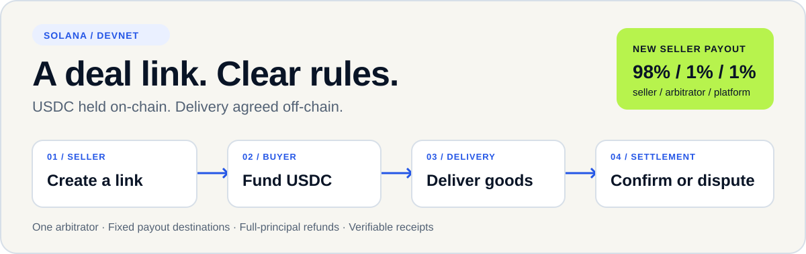
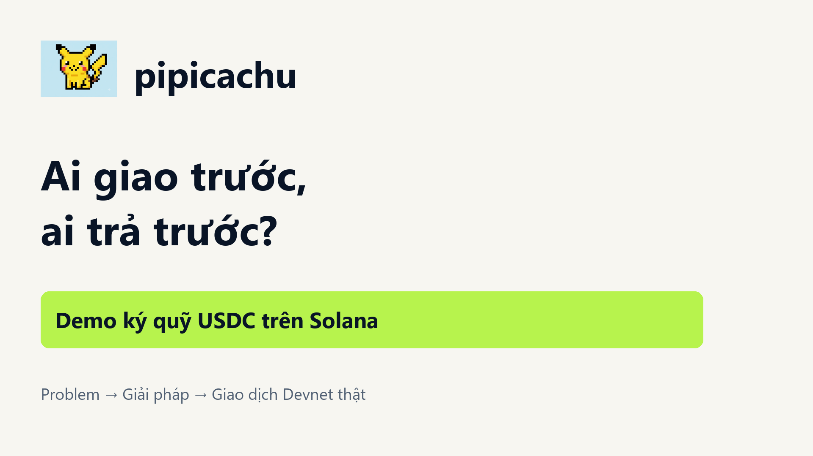
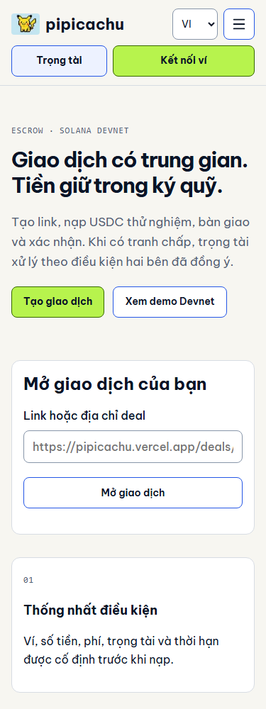
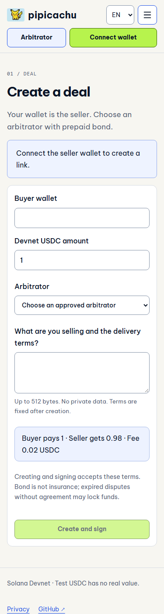
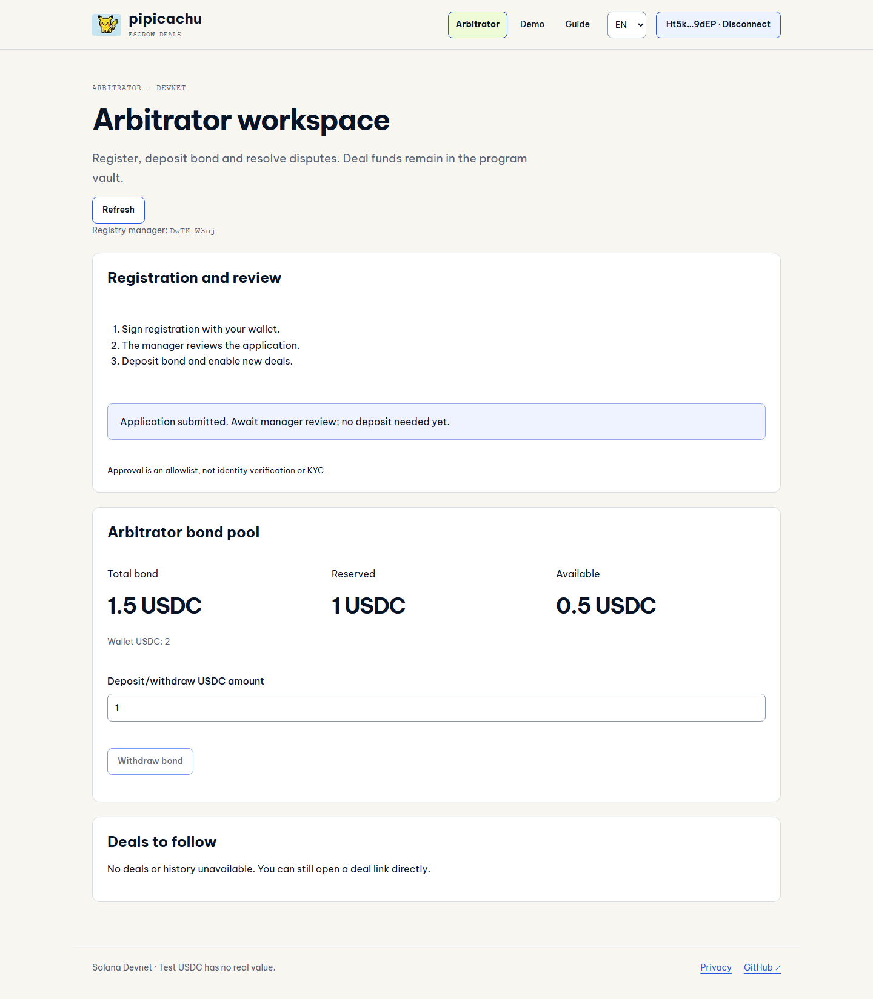

<h1 align="center">pipicachu · Ký quỹ USDC cho sản phẩm số</h1>

Dành cho người mua/bán sản phẩm số qua cộng đồng đã dùng ví Solana và USDC. Một link giao dịch, điều kiện rõ, tiền giữ trong vault của chương trình.

<a href="https://pipicachu.vercel.app">Mở sản phẩm</a> · <a href="docs/judging/README.md">Judge guide</a> · <a href="docs/evidence/v06/README.md">Trạng thái và bằng chứng</a> · <a href="README.en.md">English</a>

> **Demo Devnet.** Token thử nghiệm không có giá trị thật. Chương trình còn quyền nâng cấp, chưa audit độc lập/Mainnet/WTP. v0.6 đang nghiệm thu, chưa phải release đã hoàn thành.

## Vấn đề và người dùng

Người bán muốn nhận tiền trước khi giao gói tài nguyên số; người mua muốn kiểm tra trước khi trả. Trung gian có thể hỗ trợ, nhưng giữ tiền trong ví cá nhân tạo thêm phụ thuộc custody. pipicachu tách principal do chương trình giữ khỏi quyền xử tranh chấp của trọng tài cộng đồng.

Nhóm mục tiêu và mức phí vẫn là giả thuyết. Cảnh báo scam mua/bán online là nguồn tình huống, không phải bằng chứng khách hàng pipicachu. [Bộ dùng thử](docs/product/validation-kit.md).

## Xem happy path thật

**Footage v0.5:** ký Phantom thật, 2 USDC Devnet; người bán nhận 1,96, trọng tài và hệ thống mỗi bên 0,02. Người bán trái, người mua phải. Persona minh họa; không quay quản trị v0.6, xử muộn, dispute hoặc keeper. Video EN chờ footage UI EN riêng.

## Bốn bước giao dịch

1. Người bán chọn trọng tài khả dụng đã được duyệt, tạo link.
2. Người mua xem điều kiện, nạp USDC vào vault của deal.
3. Người bán giao hàng qua kênh ngoài ứng dụng, ghi commitment bàn giao.
4. Người mua xác nhận hoặc tranh chấp trước hạn kiểm tra. Không khiếu nại đúng hạn thì keeper có thể gửi giải ngân.

Trọng tài có workspace riêng: đăng ký → manager duyệt → nạp cọc → bật nhận. Standing consent bỏ lượt ký nhận mỗi deal. Manager đọc từ chain; duyệt là allowlist, không phải KYC.

## Điểm mạnh và nơi kiểm chứng

| Phần tự xây                                                       | Bằng chứng                                                                                           |
| ----------------------------------------------------------------- | ---------------------------------------------------------------------------------------------------- |
| Payout 98/1/1 nguyên tử, refund 100%, mở cọc đúng một lần         | [Rust](programs/pipicachu-escrow/src/lib.rs), [test executable](tests/program/cycle.ts)              |
| Treasury trùng vai trò có kiểm soát; CPI gộp theo ATA thật        | [Receipt phục hồi](docs/evidence/hotfix-alias-recovery.json), [test 4 vai](tests/program/aliases.ts) |
| Policy 1 xử muộn, deal cũ 0 giữ deadline                          | [Protocol](docs/architecture/v06.md), [test governance/capacity](tests/program/v06.ts)               |
| Manager riêng, application, chuyển quyền hai chữ ký               | [IDL](client/idl/escrow.json), [bootstrap thật](docs/evidence/v06/manager-bootstrap.json)            |
| Phục hồi pending theo signature, chặn data cũ trước thao tác tiền | [Operation](src/escrow/operation.ts), [UX](docs/design/system.md)                                    |
| Package bằng chứng có salt, kiểm local, không upload nội dung     | [Verifier](src/escrow/evidence.ts), [test vectors](tests/unit/evidence.test.ts)                      |
| RPC có giới hạn, quota chia sẻ, keeper retry từng deal            | [Backend](src/backend/), [keeper](scripts/devnet/keeper.ts)                                          |

Code đã triển khai khác bằng chứng chạy live. **Còn cổng owner duyệt application, Phantom v0.6, Redis/keeper và các nhánh policy mới Devnet.** [Một bảng trạng thái hiện tại](docs/evidence/v06/README.md).

## Vì sao dùng Solana?

Vault PDA giữ principal; SPL Token CPI chuyển USDC/phí nguyên tử. Ví ký quyền thao tác, receipt đọc độc lập. Cọc trọng tài là capacity, không bảo hiểm. Blockchain không tự gửi transaction theo đồng hồ: keeper hoặc người dùng gửi finalize.

## UI showcase

Ảnh website v0.5 đang deploy chụp 05/10, giữ làm lịch sử giao diện. Workspace mới có kiểm riêng; ảnh không chứng minh các luồng v0.6 đã duyệt live.

<table><tr><td></td><td></td></tr></table>

Ảnh workspace v0.6 từ app chạy local với **fixture application chờ duyệt** (07/10); chứng minh bố cục, không phải receipt duyệt thật:

## Kiến trúc và quyền tin cậy

Frontend theo feature → proxy RPC Devnet cố định → program Solana. Manager quản lý registry; trọng tài xử dispute theo policy; upgrade authority Devnet là quyền riêng còn giữ. Web server không giữ key manager/người mua/người bán. Redis lưu quota có TTL và report vận hành.

[Kiến trúc](docs/architecture/v06.md) · [Dependency exceptions](docs/legal/dependency-exceptions.md) · [Cổng nghiệm thu](docs/testing/v06-gates.md) · [Benchmark đọc](docs/evidence/v06/benchmark.json).

## Chất lượng triển khai

Đợt 08/10 tách client Solana và Rust theo trách nhiệm, tách controller khỏi giao diện, kiểm UTF-8/account layout và cải thiện phục hồi transaction. Giữ nguyên chức năng và ABI.

- CI đối chiếu IDL sinh từ Rust, pin Action SHA và checksum Agave; lint không warning, kiểm secret pattern và dependency exception có hạn.
- Snapshot đầy đủ giảm 4 RPC xuống 2. Sáu cặp đo Devnet: median 216,5 → 180 ms; không phải cam kết hiệu năng production.
- Báo cáo tách test tự động, receipt Devnet, Phantom và dịch vụ production; phần chưa kiểm được ghi rõ.

[Báo cáo chất lượng](docs/evidence/quality/README.md) · [Ranh giới mã nguồn](docs/architecture/quality.md) · [Tái hiện từ checkout mới](docs/testing/reproduce.md) · [Checklist kiểm thủ công](docs/deployment/OWNER_CHECKS.md).

## Chạy và tái hiện

Node 24, npm/dependency pin và lockfile. `npm ci`, copy `.env.example` vào `.env.local` trong ignore, rồi `npm run dev`. Limiter memory local không chứng minh nhiều instance. `npm run verify`; Linux/WSL `bash scripts/checks/program.sh` build và chạy synthetic local tests. Devnet writes dùng ví test riêng.

[Triển khai và secrets](docs/deployment/README.md) · [Ngữ cảnh harness](docs/harness/context/CURRENT_STATE.md) · [IDL](client/idl/escrow.json).

## Phí và giới hạn

Giả thuyết thu 1% hệ thống + 1% trọng tài khi payout; refund toàn tiền không phí. Chưa validation người dùng trả tiền hoặc doanh thu. So sánh chuyển thẳng, trung gian giữ tiền, Escrow.com, Kleros; không tuyên bố thị trường trống hay moat đã có.

Hash không chứng minh hàng đúng. Cọc không phạt xử sai. Trọng tài bỏ xử và hai bên bất đồng vẫn có thể khóa tiền. Không marketplace/USDT/đổi VND/AI/trọng tài dự phòng/Mainnet trong đợt này. Dependency exceptions và CSP report-only được ghi rõ.

## Giấy phép

Code/tài liệu tự xây: [Apache 2.0](LICENSE). [Third-party notices](THIRD_PARTY_NOTICES.md). Logo pixel được loại trừ; không cấp quyền đối với artwork, nhân vật hoặc trademark bên thứ ba.
