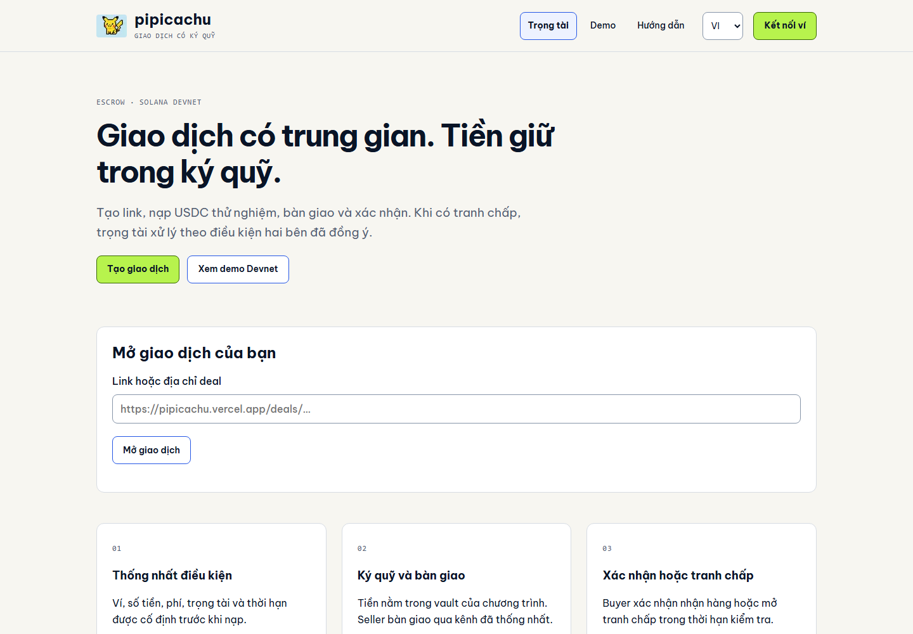
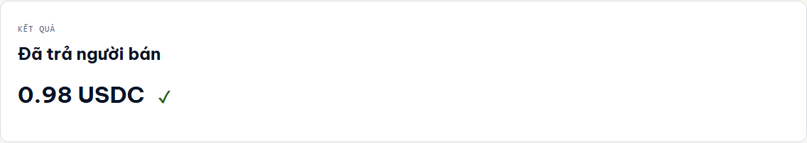
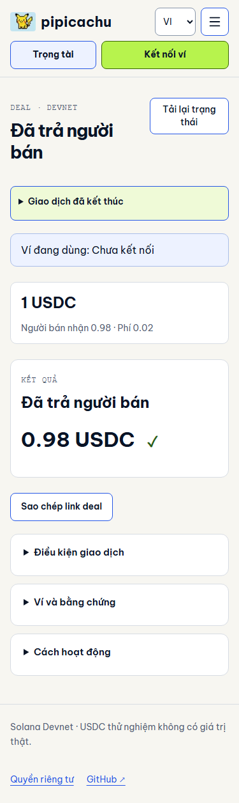
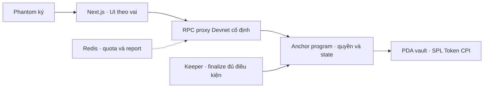

<p align="center"></p>
<h1 align="center">pipicachu · Giao dịch trung gian C2C</h1>
<p align="center">Ký quỹ USDC cho người mua/bán sản phẩm số qua cộng đồng.<br>Một link giao dịch. Tiền trong vault. Trọng tài xử tranh chấp.</p>
<p align="center">
<a href="https://github.com/2274802010922/pipicachu/actions/workflows/quality.yml"></a>
<a href="LICENSE"></a>

</p>
<p align="center"><a href="https://pipicachu.vercel.app">Mở sản phẩm</a> · <a href="docs/judging/README.md">Giám khảo: đọc 90 giây</a> · <a href="docs/judging/pitch-4min.md">Pitch 4 phút</a> · <a href="docs/evidence/quality/README.md">Bằng chứng</a> · <a href="README.en.md">English</a></p>

> **Prototype chạy trên Solana Devnet.** Token thử nghiệm; chưa audit độc lập hoặc triển khai Mainnet.

## Vấn đề: ai giao trước, ai trả trước?

Người bán file/template muốn nhận tiền trước. Người mua chưa quen người bán muốn kiểm hàng trước. Admin cộng đồng có thể làm trung gian, nhưng nếu giữ tiền trong ví cá nhân thì cả hai bên thêm một phụ thuộc vào người giữ tiền.

pipicachu tách **quyền giữ tiền** khỏi **quyền xử tranh chấp**. Người mua nạp USDC vào vault của chương trình; trọng tài chỉ chọn payout/refund tới người nhận đã chốt. Ứng dụng không tự xác minh chất lượng file.

Nhóm mục tiêu là người mua/bán sản phẩm số qua cộng đồng **đã có ví Solana và chọn USDC**. [FTC ghi nhận rủi ro thanh toán giả khi bán online](https://consumer.ftc.gov/consumer-alerts/2022/07/selling-stuff-online-heres-how-avoid-scam); đây là nguồn cho tình huống, không phải bằng chứng khách hàng pipicachu. Nhu cầu dùng và trả phí vẫn cần kiểm chứng.

## Xem sản phẩm hoạt động



**Bốn bước:** người bán tạo link → người mua nạp → người bán bàn giao → người mua xác nhận hoặc tranh chấp. Bàn giao/khiếu nại/phán quyết chỉ cần ghi chú và ký ví; hàng và bằng chứng trao qua kênh đã thỏa thuận.

Trọng tài chuẩn bị riêng: đăng ký → manager duyệt → nạp cọc → bật nhận. Standing consent bỏ lượt ký nhận từng deal; pool cọc giới hạn capacity. Approval là allowlist, không phải KYC.

[Mở kết quả Devnet thật](https://pipicachu.vercel.app/deals/25JTcp8NdyqQoTksumh8hkUszc8SD3Ea3t2SNmor8Buj) · [Receipt trên Explorer](https://explorer.solana.com/tx/5a59q7bJQfGR5Qaxd3cPpV3QBTKRETvnMMKe8L64mTjirUzbQejrUBfs1DN2ArkTob7iSF45dU7raukS9AmWSTgK?cluster=devnet)



Ảnh từ bản deploy hiện tại, kết quả fixture CLI Devnet finalized; không phải giao dịch khách hàng. [Nguồn ảnh/revision](docs/assets/showcase/current/manifest.json).

<details>
<summary>Video Phantom thật và giao diện mobile</summary>

[](https://www.youtube.com/watch?v=mTY3e3qX_4k)

Video **v0.5 happy path** do owner quay: 2 USDC → 1,96 người bán +0,02 trọng tài +0,02 hệ thống. Không quay quản trị, xử muộn hoặc keeper v0.6. Bản EN chờ footage riêng.



</details>

## Điểm mạnh có thể kiểm chứng

| Giá trị                                                | Phần triển khai và bằng chứng                                                                                                                                                   |
| ------------------------------------------------------ | ------------------------------------------------------------------------------------------------------------------------------------------------------------------------------- |
| Trung gian xử mà không giữ principal trong ví riêng    | Vault PDA, recipient cố định, quyền theo vai: [constraints](programs/pipicachu-escrow/src/contexts.rs)                                                                          |
| Tiền/phí/cọc kết thúc trong cùng transaction           | Payout 98/1/1, refund 100%, unlock một lần và alias treasury: [settlement](programs/pipicachu-escrow/src/settlement.rs), [receipt live](docs/evidence/v06/live/acceptance.json) |
| Không xin trọng tài ký nhận từng deal                  | Standing consent và prepaid capacity: [workflow](docs/product/organization-flow.md), [race/capacity tests](tests/program/v06.ts)                                                |
| RPC chậm hoặc ví bị hủy không biến thành “đã hoàn tất” | Simulation, message/signature binding, finality và recovery: [operation](src/escrow/operation.ts), [tests](tests/unit/operation.test.ts)                                        |

Khác biệt là **quy trình cộng đồng + kiểm soát tiền trong program + UX theo vai**, không phải tuyên bố escrow chưa có đối thủ. [So sánh và câu hỏi giám khảo](docs/judging/questions.md).

## Business: ai dùng, ai trả phí?

- **Người dùng:** người mua/bán file, template hoặc tài nguyên số đã dùng USDC; admin cộng đồng làm trọng tài.
- **Phí đã triển khai:** seller nhận 98%, trọng tài 1%, hệ thống 1% khi payout. Refund nguyên principal không thu phí dịch vụ; SOL mạng tính riêng.
- **Tiếp cận đề xuất:** pilot qua 1–2 admin, mời 5–10 người mua/bán thử và quyết định trên mức phí cụ thể. Đây là kế hoạch, chưa phải traction.
- **Cần kiểm chứng:** task completion, mức hiểu phí/deadline, ý định dùng lại và chấp nhận trả phí. Token Devnet không phải doanh thu.

[Bộ dùng thử](docs/product/validation-kit.md). Chưa có moat hoặc dữ liệu khách hàng trả tiền được chứng minh.

## Vì sao Solana, và phần nào tự xây?

Solana thực thi giữ/chuyển USDC: vault PDA, SPL Token CPI và settlement nguyên tử. Clock mạng quyết định deadline; ví ký quyền thao tác; receipt kiểm được độc lập. Nếu thay bằng database thuần, phải đưa quyền giữ tiền về một bên vận hành.



Tự xây state machine, constraints, settlement/cọc, client theo IDL, recovery, proxy/limiter và UI. Anchor, Solana SDK/SPL Token, Next.js và Phantom là hạ tầng; [ghi công nguồn](THIRD_PARTY_NOTICES.md).

## Bằng chứng hiện tại

| Phần                                                 | Nguồn                                                                                                                                           |
| ---------------------------------------------------- | ----------------------------------------------------------------------------------------------------------------------------------------------- |
| 122 unit/integration +41 browser; cả hai job CI pass | [CI commit 463b3fa](https://github.com/2274802010922/pipicachu/actions/runs/37812338693), [QA bỏ JSON](docs/evidence/quality/simple-notes.json) |
| Sáu nhánh Devnet finalized, bảo toàn tiền/cọc        | [Acceptance](docs/evidence/v06/live/acceptance.json) — CLI fixtures, không phải sáu lượt Phantom                                                |
| Keeper đã thực sự payout                             | [Receipt service](docs/evidence/v06/live/keeper-payout.json) — dispatch, không chứng minh uptime cron                                           |
| Binary/IDL/ABI; 46 deal giữ nguyên sau nâng cấp      | [Quality rollout](docs/evidence/quality/protocol-rollout.json), [tái hiện](docs/testing/reproduce.md)                                           |
| Owner báo đã kiểm Phantom thành công                 | Báo cáo thủ công 08/10; chưa có receipt/checklist chi tiết cho mọi ca                                                                           |

[Báo cáo hiện tại](docs/evidence/quality/README.md). [Checkpoint cũ](docs/evidence/v06/README.md) là lịch sử; không cộng số test các revision.

## Chạy từ checkout mới

Node 24; dependency/npm pin và lockfile.

```bash
npm ci
cp .env.example .env.local
npm run dev
npm run verify
```

Program tests trên Linux/WSL: `bash scripts/checks/program.sh`. Local mint synthetic; Devnet fixtures có receipt riêng. [Triển khai/env](docs/deployment/README.md) · [Kiến trúc](docs/architecture/v06.md) · [IDL](client/idl/escrow.json) · [Contributor workflow](.github/CONTRIBUTING.md).

## Phạm vi tin cậy

Trọng tài vẫn có thể xử sai; cọc là capacity, không bảo hiểm/slashing. Bỏ xử và hai bên bất đồng có thể khóa tiền. Keeper theo lịch có thể trễ; demo trực tiếp dùng người mua xác nhận. Devnet còn upgrade authority. Hash không xác minh hàng hoặc mã hóa ghi chú; file/bằng chứng không upload lên server.

Chưa audit độc lập, Mainnet hoặc validation doanh thu. [Báo lỗi bảo mật](.github/SECURITY.md) · [Dependency exceptions](docs/legal/dependency-exceptions.md) · [Apache-2.0](LICENSE). Logo/artwork bên thứ ba không được cấp quyền qua license code.
