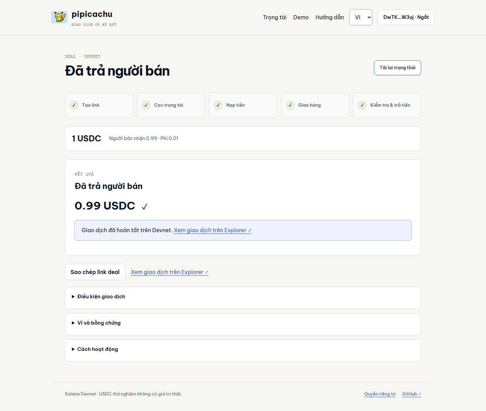

<p align="center"></p>
<h1 align="center">pipicachu · Giao dịch trung gian</h1>
<p align="center">Link giao dịch cho admin trung gian và khách của họ.<br>Tiền nằm trong escrow Solana; bàn giao, xác nhận và tranh chấp theo điều kiện đã chốt.</p>
<p align="center"><a href="https://pipicachu.vercel.app">Website</a> · <a href="https://pipicachu.vercel.app/demo">Demo Devnet</a> · <a href="README.en.md">English</a> · <a href="docs/README.md">Tài liệu</a></p>

> **Chỉ Devnet.** USDC thử nghiệm không có giá trị thật. Chương trình còn quyền nâng cấp và chưa audit độc lập. Không dùng tài sản thật.

## Sản phẩm dành cho ai?

Admin trung gian đang hỗ trợ giao dịch hàng/dịch vụ số qua cộng đồng. pipicachu tách việc giữ tiền khỏi ví cá nhân của admin: buyer nạp vào vault, seller bàn giao ngoài chuỗi, chương trình giải ngân theo xác nhận/thời hạn/phán quyết. Chưa có nghiên cứu người dùng hoặc doanh thu được kiểm chứng; nhu cầu trả phí vẫn là giả thuyết.

## Một luồng nhỏ, chạy trọn vẹn

```text
Seller tạo link → Hai trọng tài chấp thuận → Buyer nạp USDC
  ├─ Seller không bàn giao đúng hạn → Hoàn buyer
  └─ Seller báo bàn giao
       ├─ Buyer xác nhận → Trả seller
       ├─ Hết hạn kiểm tra, không tranh chấp → Có thể gửi lệnh giải ngân
       └─ Buyer tranh chấp → Trọng tài chính → Dự phòng → Đồng thuận hai bên
```

- Các bên, mint, số tiền, phí và thời hạn cố định khi tạo.
- Phí demo 1% trừ vào seller payout; refund không thu phí.
- Mỗi trọng tài khóa cọc 10% giá trị deal khi buyer nạp; mở khóa khi kết thúc.
- Trọng tài chỉ có thể trả seller hoặc hoàn buyer, không nhập địa chỉ nhận tùy ý.
- Hết hạn là đủ điều kiện gửi giao dịch, không có keeper tự động.

## Giới hạn

Escrow không kiểm chứng hàng hóa ngoài chuỗi hoặc bảo đảm tài khoản game không bị thu hồi. Hash chỉ gắn với nội dung bằng chứng đã trao đổi. Cọc không phải bảo hiểm và **chưa có phạt xử sai**. Nếu cả hai trọng tài bỏ xử và hai bên không đồng ý, tiền có thể còn khóa. Upgrade authority và quyền của tổ chức phát hành USDC vẫn là yếu tố tin cậy.

## Công nghệ và phần tự xây

Next.js/React/TypeScript, Rust/Anchor, SPL Token. Tự xây state machine, vault/cọc, quyền trọng tài, timeout, UI VI/EN và harness. Anchor/SPL cung cấp serialization, account constraints và token CPI; không tuyên bố phát minh escrow.

Không AI, database tài khoản, chatbot, marketplace hoặc off-ramp. Backend không giữ key có quyền rút tiền. Trạng thái tiền nằm on-chain.

## Chạy và kiểm

```bash
npm ci
cp .env.example .env.local
npm run dev
npm run verify
```

Chương trình: [kiến trúc](docs/architecture/README.md), [kiểm thử](docs/testing/README.md), [triển khai](docs/deployment/README.md). `npm run test:program` cần validator riêng với `.so` đã build.

## Dễ tìm phần cần chấm



Đã kiểm 7 flow / 42 checks trên chương trình local và Devnet; 23 unit/IDL tests, 7 browser tests và CI web/program. Luồng ký qua website Vercel đã chạy với provider test, không gọi đó là kiểm Phantom extension thật. Xem bằng chứng bên dưới.

| Nội dung                 | Đường dẫn                                              |
| ------------------------ | ------------------------------------------------------ |
| Smart contract           | [lib.rs](programs/pipicachu-escrow/src/lib.rs)         |
| IDL sinh từ Rust         | [escrow.json](client/idl/escrow.json)                  |
| Client instruction/state | [client.ts](src/escrow/client.ts)                      |
| Luồng on-chain và số dư  | [cycle.ts](tests/program/cycle.ts)                     |
| Bằng chứng               | [docs/evidence](docs/evidence/README.md)               |
| UI/design                | [design system](docs/design/system.md)                 |
| Ngữ cảnh                 | [CURRENT_STATE](docs/harness/context/CURRENT_STATE.md) |

## License và lịch sử

Code MIT; logo ngoài phạm vi MIT. [LICENSE](LICENSE), [THIRD_PARTY_NOTICES](THIRD_PARTY_NOTICES.md). Ý tưởng tra cứu cũ giữ tại checkpoint `7315d42`, xem [archive](docs/archive/README.md). Các API cũ đã thay khỏi sản phẩm. Picachu cũ không bị sửa.
