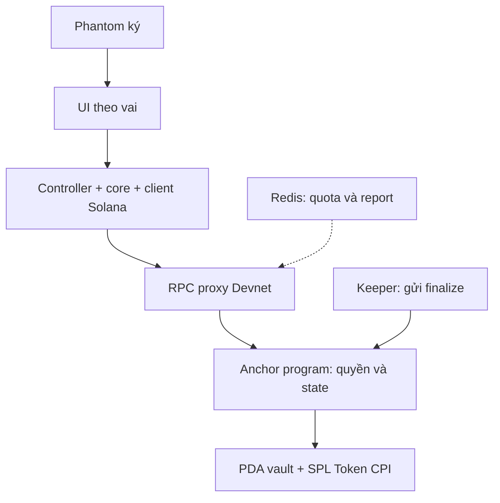

<p align="center"></p>
<h1 align="center">pipicachu · Giao dịch trung gian C2C</h1>
<p align="center">Ký quỹ USDC cho người mua/bán sản phẩm số qua cộng đồng.<br>Một link giao dịch. Điều kiện rõ. Tiền trong vault của chương trình.</p>
<p align="center">
<a href="https://github.com/2274802010922/pipicachu/actions/workflows/quality.yml"></a>
<a href="LICENSE"></a>

</p>
<p align="center"><a href="https://pipicachu.vercel.app">Mở sản phẩm</a> · <a href="#demo">Xem demo</a> · <a href="#điểm-mạnh-theo-tiêu-chí">Điểm mạnh</a> · <a href="README.en.md">English</a></p>

## Người mua muốn kiểm hàng. Người bán muốn nhận tiền.

Một người bán chia sẻ gói template trong cộng đồng. Người mua quan tâm, hai bên đã có ví Solana và chọn thanh toán bằng USDC. Người bán muốn biết tiền đã sẵn sàng trước khi giao file; người mua muốn có thời gian kiểm tra trước khi trả tiền.

Admin cộng đồng có thể hỗ trợ giao dịch. **pipicachu đưa tiền vào vault của chương trình và giao việc xử tranh chấp cho trọng tài được các bên chọn.** Người mua, người bán và trọng tài cùng theo dõi một deal, với số tiền, điều kiện và thời hạn đã chốt.

## Một link, bốn bước giao dịch


| Bước                         | Người thực hiện                                                         | Kết quả                                                   |
| ---------------------------- | ----------------------------------------------------------------------- | --------------------------------------------------------- |
| **1. Tạo link**              | Người bán chọn trọng tài khả dụng, nhập người mua, số tiền và điều kiện | Deal có thông tin cố định và link chia sẻ                 |
| **2. Nạp tiền**              | Người mua xem điều kiện, ký nạp USDC                                    | Tiền nằm trong vault trước khi bàn giao                   |
| **3. Bàn giao**              | Người bán gửi file qua kênh đã thống nhất, ghi chú và ký                | Deal chuyển sang bước người mua kiểm tra                  |
| **4. Xác nhận / tranh chấp** | Người mua xác nhận nhận hàng hoặc khiếu nại trước hạn                   | Chương trình giải ngân, hoặc trọng tài chọn payout/refund |

Trọng tài có workspace riêng để đăng ký, được duyệt, nạp cọc và bật nhận. **Cọc sẵn và chấp thuận trước** giúp deal mới đi thẳng tới bước người mua nạp tiền. Phần cọc được giữ theo các deal đang hoạt động và mở lại khi kết thúc.

## Mô hình phí gắn với kết quả giao dịch

Với một deal mới **1 USDC** được trả cho người bán:

| Người nhận         |   Tỷ lệ |       Số tiền |
| ------------------ | ------: | ------------: |
| Người bán          | **98%** | **0,98 USDC** |
| Trọng tài          |  **1%** | **0,01 USDC** |
| Hệ thống pipicachu |  **1%** | **0,01 USDC** |

Ba khoản được chuyển trong cùng transaction. Khi hoàn người mua, chương trình trả toàn bộ tiền giao dịch và phí dịch vụ bằng 0; SOL mạng được tính riêng.

**Mô hình doanh thu:** hệ thống thu 1% khi payout cho người bán; trọng tài nhận 1% cho vai trò xử lý giao dịch. **Hướng tiếp cận:** cộng tác với admin cộng đồng đã dùng USDC, đưa link deal vào kênh mua bán hiện có. Giao diện chung giúp ba bên phối hợp mà không phải chuyển sang một marketplace mới.

## Demo

[Mở sản phẩm](https://pipicachu.vercel.app) · [Xem deal mẫu đã hoàn tất](https://pipicachu.vercel.app/deals/25JTcp8NdyqQoTksumh8hkUszc8SD3Ea3t2SNmor8Buj) · [Đối chiếu receipt trên Explorer](https://explorer.solana.com/tx/5a59q7bJQfGR5Qaxd3cPpV3QBTKRETvnMMKe8L64mTjirUzbQejrUBfs1DN2ArkTob7iSF45dU7raukS9AmWSTgK?cluster=devnet)


Giao dịch mẫu **USDC Devnet**, ký bằng ví CLI và đã finalized: 1 USDC →0,98 người bán +0,01 trọng tài +0,01 hệ thống. [Nguồn ảnh và revision capture](docs/assets/showcase/current/manifest.json).

[](https://www.youtube.com/watch?v=mTY3e3qX_4k)

**Video v0.5 · happy path · Phantom thật:** 2 USDC →1,96 người bán +0,02 trọng tài +0,02 hệ thống.

## Điểm mạnh theo tiêu chí

### BEST PRODUCT & BUSINESS

- **Nhóm dùng cụ thể:** người mua/bán file, template và tài nguyên số qua cộng đồng, đã có ví Solana và dùng USDC. Người mua có bước kiểm tra; người bán thấy trạng thái ký quỹ trước khi giao; trọng tài có workspace quản lý cọc và deal.
- **Quy trình phù hợp kênh giao dịch hiện có:** một link cho ba vai, file trao qua kênh đã thống nhất, bốn bước trên ứng dụng và số tiền nhận hiển thị trước khi ký.
- **Mô hình phí được thực thi trong program:** 1% hệ thống +1% trọng tài khi payout, refund toàn tiền với phí dịch vụ 0. Hướng tiếp cận qua admin cộng đồng kết nối cơ chế phí với người điều phối giao dịch.

**Bằng chứng:** [flow và phí](docs/product/README.md) · [settlement trên Devnet](docs/evidence/v06/live/acceptance.json).

### BEST TECHNICAL BUILD

- **Xử lý các tình huống tiền thực tế:** state machine cho nạp, bàn giao, kiểm tra, dispute và settlement; kiểm đồng thời capacity, payout/refund, chống chi lặp và mở cọc đúng một lần.
- **Bảo toàn điều kiện qua phiên bản:** hỗ trợ deal cũ/mới, policy xử muộn và treasury trùng một role; các khoản chuyển được gộp theo token account thực, tổng tiền vẫn khớp.
- **Phục hồi transaction theo bằng chứng mạng:** lưu signature/blockhash/expiry, theo dõi finality, kiểm trạng thái trước retry và broadcast lại cùng bytes. Harness kiểm native Rust, SBF executable, negative cases và invariant tiền/cọc.

**Bằng chứng:** [Rust settlement](programs/pipicachu-escrow/src/settlement.rs) · [race/capacity/policy tests](tests/program/v06.ts) · [operation recovery](src/escrow/operation.ts).

### Most Innovative Solution

- **Tách hai trách nhiệm của trung gian:** program giữ tiền và thực thi chuyển tiền; trọng tài phán quyết giữa các người nhận đã chốt. Quy trình cộng đồng vẫn giữ vai trò con người trong dispute.
- **Standing consent + cọc sẵn:** trọng tài chuẩn bị pool một lần và chủ động bật nhận; mỗi lần buyer fund, program kiểm capacity và reserve cọc nguyên tử. Giảm lượt ký nhận từng deal và tái sử dụng capacity sau settlement.
- **Một link phối hợp các vai:** cùng terms, trạng thái và deadline; màn hình đưa đúng hành động tiếp theo cho từng ví.

**Bằng chứng:** [standing consent/capacity](docs/product/organization-flow.md) · [quyền và state machine](programs/pipicachu-escrow/src/lib.rs) · [view model](src/escrow/view-model.ts).

### Best Solana Integration

- **Solana trực tiếp giữ và chuyển USDC:** vault PDA của từng deal, SPL Token CPI và payout nguyên tử tới người bán, trọng tài, hệ thống; refund về người mua.
- **Clock và finality nằm trong flow:** thời hạn dùng Clock mạng; wallet ký transaction; UI theo dõi confirmed/finalized để hiển thị kết quả theo dữ liệu blockchain.
- **Receipt có thể đối chiếu độc lập:** các nhánh confirm, timeout, ruling hai hướng, xử muộn, mutual settlement và keeper payout đều có dữ liệu Devnet để xem lại.

**Bằng chứng:** [account constraints/PDA](programs/pipicachu-escrow/src/contexts.rs) · [sáu nhánh finalized](docs/evidence/v06/live/acceptance.json) · [keeper service payout](docs/evidence/v06/live/keeper-payout.json).

### Best Security & Privacy Solution

- **Quyền tiền được kiểm trong program:** signer, role, mint, owner, PDA, state và recipient cố định; checked arithmetic và tổng payout bảo toàn tiền giao dịch.
- **Kiểm trước và sau khi ví ký:** simulation, message/signature binding, genesis Devnet cố định, validation/caps và shared rate limiter cho RPC. Các yêu cầu chuyển tiền có cổng kiểm dịch vụ trước khi gửi.
- **Dữ liệu theo đúng nhu cầu xử lý:** người dùng tự giữ khóa và ký Phantom; hàng/bằng chứng trao qua kênh đã thống nhất, ghi chú được băm trong trình duyệt. Limiter lưu IP dạng HMAC có TTL; web không giữ private key của các role.

**Bằng chứng:** [constraints](programs/pipicachu-escrow/src/contexts.rs) · [wallet binding](src/escrow/wallet-transaction.ts) · [RPC validation](src/backend/rpc.ts) · [HMAC/Redis](src/backend/redis.ts).

### Best User Experience

- **Bốn bước, hành động theo vai:** người mua thấy nút nạp/xác nhận; người bán thấy bàn giao; trọng tài thấy phán quyết. Bước hiện tại và CTA được làm nổi bật.
- **Thao tác ngắn và feedback rõ:** ghi chú rồi ký, dialog hiển thị số tiền/recipient/phí; các trạng thái chờ ký, đã gửi, đang xác nhận, finalized và retry được tách rõ.
- **VI/EN và nhiều kích thước màn hình:** giữ input khi đổi ngôn ngữ, controls tối thiểu 44px, focus/bàn phím và kiểm axe ở 375/768/1024/1440px.

**Bằng chứng:** [flow theo vai](src/escrow/view-model.ts) · [QA responsive/axe](tests/e2e/organization.spec.ts) · [luồng ghi chú/ký](tests/e2e/simple-notes.spec.ts).


### Best System Architecture

- **Ranh giới trách nhiệm rõ:** UI trình bày, controller điều phối hành động, core xử lý state/amount, client Solana xây/đọc instruction, backend kiểm RPC và program quyết định quyền tiền.
- **Một nguồn schema và quyết định:** IDL dùng cho discriminator/account order/signer/writable; view model thống nhất role/action/deadline. Các lớp dùng lượng nguyên BigInt/u64 và giữ tương thích ABI.
- **Có thể tái hiện và kiểm độc lập:** dependency/lockfile pin, CI pin Action SHA/checksum Agave, so IDL từ Rust; test web, browser và program chạy trong pipeline. Snapshot account được batch thành 2 RPC cho một lần đọc đầy đủ.



**Bằng chứng:** [module boundaries](docs/architecture/quality.md) · [IDL](client/idl/escrow.json) · [CI](.github/workflows/quality.yml) · [snapshot queries](src/escrow/queries.ts).

## Bằng chứng triển khai

| Kết quả                      | Phạm vi được kiểm                                                                       | Nguồn                                                                                    |
| ---------------------------- | --------------------------------------------------------------------------------------- | ---------------------------------------------------------------------------------------- |
| **122 unit/integration**     | Amount, state, codec, quyền, operation và recovery                                      | [CI source dd32f2e](https://github.com/2274802010922/pipicachu/actions/runs/37876012065) |
| **41 browser tests**         | VI/EN, role flow, responsive, keyboard/axe và wallet interaction qua injected provider  | [Browser harness](tests/e2e/)                                                            |
| **6 nhánh Devnet finalized** | Confirm, timeout bàn giao, ruling payout/refund, xử muộn và mutual refund; CLI fixtures | [Receipts và token deltas](docs/evidence/v06/live/acceptance.json)                       |
| **Keeper payout**            | Một transaction service-signed đã trả đúng 98/1/1 và mở cọc                             | [Receipt workflow dispatch](docs/evidence/v06/live/keeper-payout.json)                   |
| **46 deal tương thích**      | Money, fee, terms, state, workflow, policy và deadlines giữ nguyên sau upgrade đã kiểm  | [Binary/IDL/snapshot](docs/evidence/quality/protocol-rollout.json)                       |

Số liệu theo revision và loại kiểm thử; [báo cáo kỹ thuật](docs/evidence/quality/README.md) lưu nguồn đầy đủ.

## Chạy và tái hiện

Node 24, npm/dependency pin và lockfile.

```bash
npm ci
cp .env.example .env.local
npm run dev
npm run verify
```

Program harness trên Linux/WSL: `bash scripts/checks/program.sh`. [Deployment/config](docs/deployment/README.md) · [Kiến trúc và mô hình quyền](docs/architecture/v06.md) · [Hướng dẫn tái hiện](docs/testing/reproduce.md) · [Contributor workflow](.github/CONTRIBUTING.md).

## Mã nguồn và ghi công

Tự xây state machine, constraints, settlement/cọc, client, recovery, proxy/limiter và UI. Hạ tầng sử dụng Anchor, Solana SDK/SPL Token, Next.js và Phantom.

Code [Apache-2.0](LICENSE) · [Third-party và artwork notices](THIRD_PARTY_NOTICES.md) · [Security reporting](.github/SECURITY.md).
